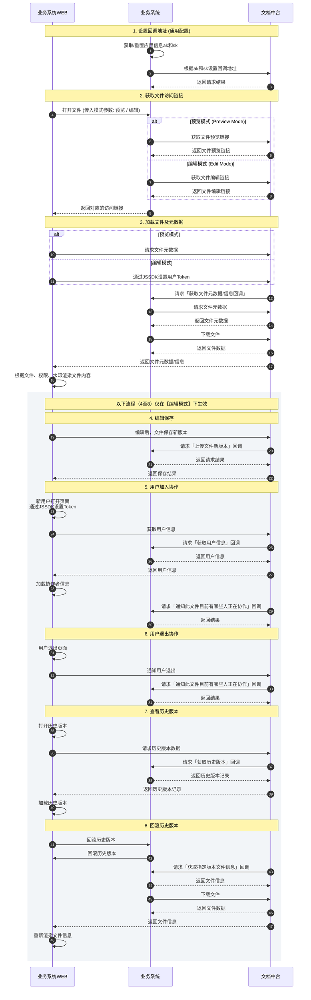

```mermaid
sequenceDiagram
    autonumber
    participant WEB as 业务系统WEB
    participant SYS as 业务系统
    participant MID as 文档中台

    %% 1. 设置回调地址
    Note over WEB, MID: 1. 设置回调地址 (通用配置)
    SYS->>SYS: 获取/重置应用信息ak和sk
    SYS->>MID: 根据ak和sk设置回调地址
    MID-->>SYS: 返回请求结果

    %% 2. 获取文件访问链接 (条件分支)
    Note over WEB, MID: 2. 获取文件访问链接
    WEB->>SYS: 打开文件 (传入模式参数: 预览 / 编辑)
    
    alt 预览模式 (Preview Mode)
        SYS->>MID: 获取文件预览链接
        MID-->>SYS: 返回文件预览链接
    else 编辑模式 (Edit Mode)
        SYS->>MID: 获取文件编辑链接
        MID-->>SYS: 返回文件编辑链接
    end
    
    SYS-->>WEB: 返回对应的访问链接

    %% 3. 加载文件信息 (条件分支)
    Note over WEB, MID: 3. 加载文件及元数据
    
    alt 预览模式
        WEB->>MID: 请求文件元数据
    else 编辑模式
        WEB->>MID: 通过JSSDK设置用户Token
    end
    
    MID->>SYS: 请求「获取文件元数据/信息回调」
    SYS->>MID: 请求文件元数据
    MID-->>SYS: 返回文件元数据
    SYS->>MID: 下载文件
    MID-->>SYS: 返回文件数据
    MID-->>WEB: 返回文件元数据/信息
    WEB->>WEB: 根据文件、权限、水印渲染文件内容

    %% 灰色区块：标记仅在编辑/协作模式下发生的后续交互
    rect rgb(242, 245, 248)
        Note over WEB, MID: 以下流程（4至8）仅在【编辑模式】下生效

        %% 4. 编辑保存
        Note over WEB, MID: 4. 编辑保存
        WEB->>MID: 编辑后，文件保存新版本
        MID->>SYS: 请求「上传文件新版本」回调
        SYS-->>MID: 返回请求结果
        MID-->>WEB: 返回保存结果

        %% 5. 用户加入协作
        Note over WEB, MID: 5. 用户加入协作
        WEB->>WEB: 新用户打开页面<br/>通过JSSDK设置Token
        WEB->>MID: 获取用户信息
        MID->>SYS: 请求「获取用户信息」回调
        SYS-->>MID: 返回用户信息
        MID-->>WEB: 返回用户信息
        WEB->>WEB: 加载协作者信息
        MID->>SYS: 请求「通知此文件目前有哪些人正在协作」回调
        SYS-->>MID: 返回结果

        %% 6. 用户退出协作
        Note over WEB, MID: 6. 用户退出协作
        WEB->>WEB: 用户退出页面
        WEB->>MID: 通知用户退出
        MID->>SYS: 请求「通知此文件目前有哪些人正在协作」回调
        SYS-->>MID: 返回结果

        %% 7. 查看历史版本
        Note over WEB, MID: 7. 查看历史版本
        WEB->>WEB: 打开历史版本
        WEB->>MID: 请求历史版本数据
        MID->>SYS: 请求「获取历史版本」回调
        SYS-->>MID: 返回历史版本记录
        MID-->>WEB: 返回历史版本记录
        WEB->>WEB: 加载历史版本

        %% 8. 回滚历史版本
        Note over WEB, MID: 8. 回滚历史版本
        WEB->>SYS: 回滚历史版本
        SYS->>WEB: 回滚历史版本
        MID->>SYS: 请求「获取指定版本文件信息」回调
        SYS-->>MID: 返回文件信息
        SYS->>MID: 下载文件
        MID-->>SYS: 返回文件数据
        MID-->>WEB: 返回文件信息
        WEB->>WEB: 重新渲染文件信息
    end
```