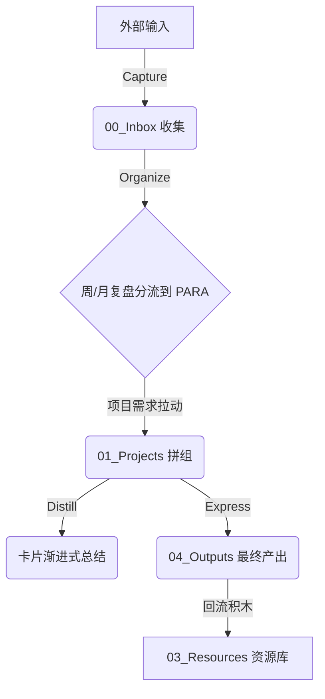

# 📖 如何使用本知识库：第二大脑构建与运营指南

> [!TIP]
> 这是一个基于 **Obsidian** 构建，融合了 **CODE 知识循环** 与 **PARA 行动整理** 理论的“第二大脑（Second Brain）”系统。
> 本系统专为高级解决方案专家、自媒体创作者和创业筹备者定制。它的终极目标是**“项目拉动、行动优先、拼图式复用”**，而非做一个静态的“收藏夹”。

---

## 🗺️ 第一部分：知识库的“构建逻辑” (PARA 2.0)

本知识库不是按学科（如：心理学、计算机）堆砌资料，而是**严格按照“行动的紧迫性”**进行分类。

### 1. 顶层目录地图 (PARA + Outputs)

```text
📁 Second Brain Vault
├── 📥 00_Inbox         --> 信息输入第一站（不分类，不整理，每天清空）
├── 🚀 01_Projects      --> 核心战场（当前正在推进、有具体截止日期的项目文件夹）
├── 👥 02_Areas         --> 责任领域（需要持续维持高标准、没有明确终点的日常职责）
├── 📚 03_Resources     --> 主题资源库（未来可能会被项目调用的“原料库”）
├── 🏆 04_Outputs       --> 终稿成果库（写好的文章、PPT方案、SOP成果，方便以后复用）
├── 🗃️ 05_Archives      --> 归档区（已结束的项目、失效的责任、不再关注的主题）
├── ⚙️ 99_System        --> 操作系统（规范、复盘模板、Dashboard首页控制台）
│
├── 📄 index.md         --> 内容索引（LLM 查询前首选，按类别列出全部页面、摘要和元数据）
├── 📋 log.md           --> 操作日志（只增时间戳记录，追溯知识库演化历程）
└── 📖 如何使用本知识库.md --> 运营指南（本文件）
```

### 2. 资源域的“乐高化”子结构

在 `03_Resources` 中，你的五大核心主题（底层原理、商业化、AI与计算机、自媒体、AI解决方案）统一分成了 6 类卡片 + 2 个加工目录：

**卡片类型：**
* **`01_概念卡/ (C-)`**：思维模型、定义和知识概念（如：`C-第一性原理`）。
* **`02_方法卡/ (M-)`**：操作步骤、SOP 流程（如：`M-公众号写作流程`）。
* **`03_案例卡/ (A-)`**：成熟案例、具体启发与 ROI。
* **`04_问题卡/ (Q-)`**：核心痛点剖析与行动方案。
* **`05_原始资料/`**：未经提炼的网页剪藏或会议摘录。
* **`06_原则卡/ (P-)`**：决策准则、判断标准（如：`P-稀缺性原则`）。

**加工目录：**
* **`inbox/`**：放置原始素材原文（文章、报告、剪藏等），保持完整不修改。
* **`abstract/`**：放置对应原文的阅读摘要，供快速概览。

**加工工作流：** 原文 → `inbox/` → 提炼摘要 → `abstract/` → 提取卡片 → 对应卡目录

---

## 🔄 第二部分：知识库的“运营逻辑” (CODE 闭环)

第二大脑就像一个“知识加工厂”，信息在这里会经历**捕获、整理、提炼、表达**的完整流水线：



### 1. 捕获 (Capture) —— 低摩擦收集
* **法则**：日常觉得“有共鸣”的网页、微信推文或随想，**一键剪藏/随手写下丢进 `00_Inbox`**。
* **戒律**：捕获时**千万不要花时间做分类**！避免思考瓶颈，整理和捕获必须分离。

### 2. 整理 (Organize) —— 行动性归位
* **法则**：每周五复盘时，打开收件箱分流：
  * 这周要做出结果吗？👉 放入 `01_Projects`
  * 长期要维持的标准？👉 放入 `02_Areas`
  * 未来潜在的原料？👉 放入 `03_Resources`

### 3. 提炼 (Distill) —— 渐进式披露
不需要一次性把笔记整理完！**只在你要用到它时，顺手做以下提炼**（详见：`99_System/08_渐进式披露规则`）：
* **Layer 1**：原始收集（保留原文）
* **Layer 2**：高亮重点（顺手把最重要的一两句话**加粗**）
* **Layer 3**：粗提炼（在卡片顶部用自己的大白话写 3 条一句话总结）
* **Layer 4**：输出级结论（提炼成以后可以直接复制到 PPT 或文章里的结论/SOP/模板）

### 4. 表达 (Express) —— 乐高式拼装
* 当你需要写公众号推文（`P-自媒体内容系统`）或为客户做大模型知识库方案（`P-AI解决方案能力提升`）时，**千万不要从零开始**！
* 在 `03_Resources` 中搜索你之前沉淀的 **概念卡(C-)**、**方法卡(M-)** 和 **案例卡(A-)**，把它们像“想法群岛”一样拖进项目大纲中。
* 编写过渡语，快速组装出你的方案，完成最终交付（存入 `04_Outputs`）。

---

## 🚀 第三部分：新人 5 分钟上手指南

如果你是第一次使用这个知识库，请按照以下 4 步开始：

### 1. 设置模版路径
在 Obsidian 的 `设置 -> 核心插件 -> 模板 (Templates)` 中，将**模板文件夹路径**设置为：`_Templates`。

### 2. 双链全局检索 (极简前缀法)
本系统采用前缀命名规范（详见：`99_System/02_命名规范`）：
* 全局新建项目时，文件名加上 `P-`；概念加上 `C-`；方法加上 `M-` 等。
* 以后在任何笔记中输入 `[[C-第一性原理` 或 `[[M-`，系统会瞬间精准联想出所有成熟的“思维积木”，供你调用。

### 3. 极简日常运转流
* **每日**：有灵感/资料先统统丢进 `00_Inbox`。下班前花 5 分钟用 [[_Templates/T-Inbox|T-Inbox 模板]] 整理归位。
* **每周五 16:30**：花 30 分钟，对照 [[99_System/06_周复盘模板|周复盘清单]] 彻底清空 Inbox，更新项目进度。
* **每月月底**：花 1 小时，对照 [[99_System/07_月复盘模板|月复盘清单]] 做系统的健康度盘点。

### 4. 用 index.md + log.md 高效查询
本知识库根目录有两个面向 LLM 的系统文件：

**`index.md`（内容索引）**
- 按类别列出全部页面及其链接、一行摘要和来源数量等元数据
- 查询时，LLM 优先读此文件定位相关卡片/文档，再深入查看详情
- 每次导入新素材后需同步更新
- 避免了对基于嵌入的 RAG 基础设施的依赖，在中等规模（约 100 个来源）下效果良好

**`log.md`（操作日志）**
- 按时间顺序只增记录：`## [YYYY-MM-DD] 操作类型 | 标题`
- 每条记录以固定前缀开头，支持 Unix 工具解析：
  ```bash
  grep "^## \\\[" log.md | tail -5   # 查看最近 5 条操作
  ```
- 帮助 LLM 了解最近进行了哪些操作，追溯知识库演化历程

---

> [!IMPORTANT]
> **第二大脑的核心奥义**：不完美的系统能用起来，远比完美的系统躺在硬盘里吃灰更有价值。开始你的 Capture 吧！
