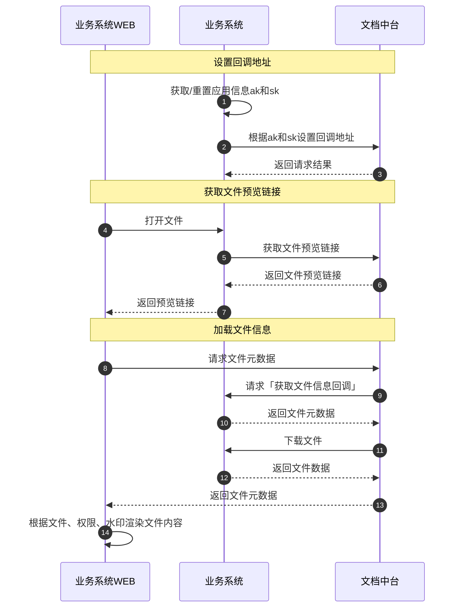

```mermaid
sequenceDiagram
    autonumber
    participant WEB as 业务系统WEB
    participant SYS as 业务系统
    participant MID as 文档中台

    %% 第一阶段：设置回调地址
    Note over WEB, MID: 设置回调地址
    SYS->>SYS: 获取/重置应用信息ak和sk
    SYS->>MID: 根据ak和sk设置回调地址
    MID-->>SYS: 返回请求结果

    %% 第二阶段：获取文件预览链接
    Note over WEB, MID: 获取文件预览链接
    WEB->>SYS: 打开文件
    SYS->>MID: 获取文件预览链接
    MID-->>SYS: 返回文件预览链接
    SYS-->>WEB: 返回预览链接

    %% 第三阶段：加载文件信息
    Note over WEB, MID: 加载文件信息
    WEB->>MID: 请求文件元数据
    MID->>SYS: 请求「获取文件信息回调」
    SYS-->>MID: 返回文件元数据
    MID->>SYS: 下载文件
    SYS-->>MID: 返回文件数据
    MID-->>WEB: 返回文件元数据
    WEB->>WEB: 根据文件、权限、水印渲染文件内容
```